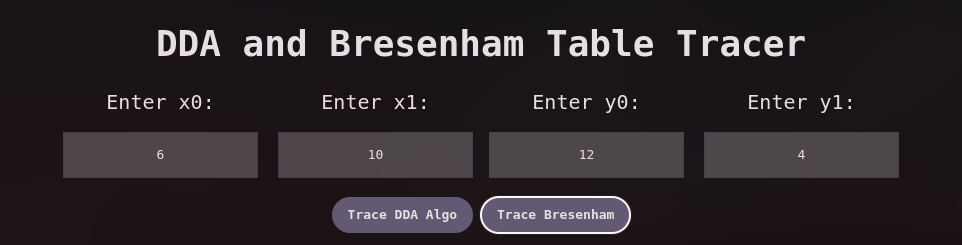
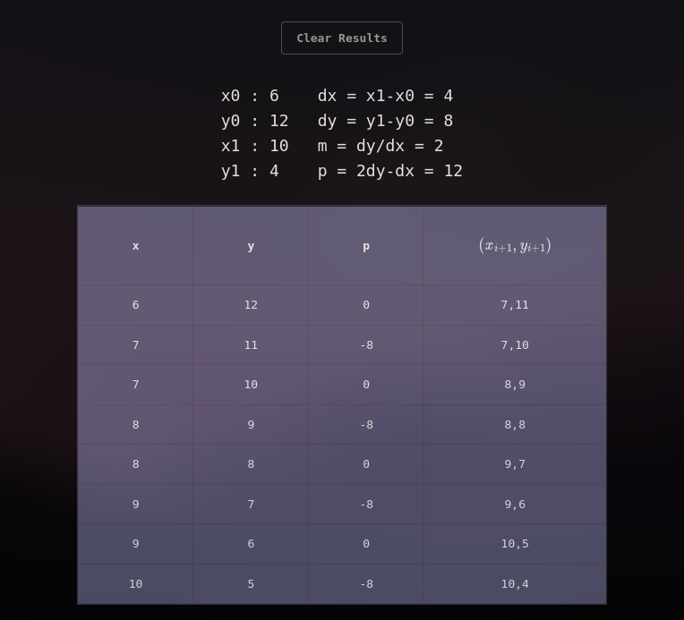
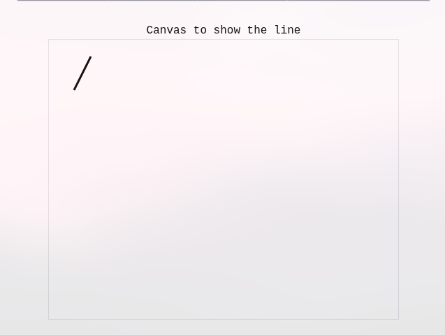

## Scan Conversion Algorithm Tracing

This is a simple project that i made on tracing the algorithm of DDA and bresenham using tables which is boring to do by hand.

##### Screenshot

##### Usage Guide

* Firstly input the start points and end points to the respective containers of the inputs
* After the data has been entered just click the trace dda or the trace bresenham button which will generate the calculations and the table for the tracing.

* The calculations for bresenham algorithm is shown in the example below:

  
* Also a canvas is below the table which shows the line that has been drawn according to our inputs which is shown below:

* In this canvas the top left corner denotes the coordinates (0,0) so it is a bit different from the normal kind of coordinates plotting we do in paper but atleast we get the general idea for how the line is drawn and if the coordinates are correct or not.
* There is a clear button which is generated after the result has been shown which can be used to clear the canvas and the element of the form to input new values and get the new traced table and the drawn line.

---
